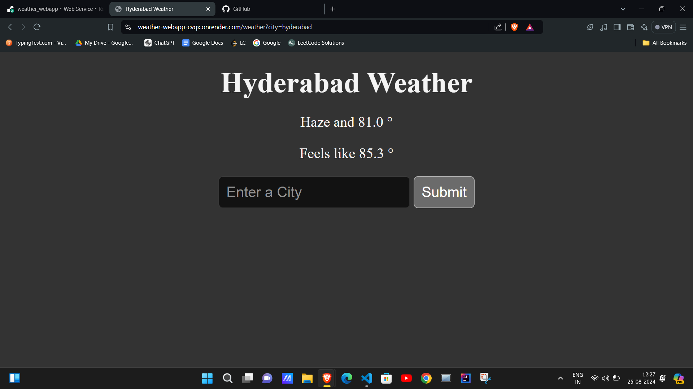

# ☀️Weather Web application

## 🚀 The webapp is live at: 
https://weather-webapp-cvqx.onrender.com/

## 🌥️Overview
The Weather Web Application is a simple yet effective project to understand web application development using Flask. This application leverages the OpenWeather API to fetch and display current weather data for major cities worldwide. 

## 🤖Technologies Used
- **Python**: The core programming language used for development.
- **Flask**: A lightweight WSGI web application framework for Python.
- **HTML/CSS**: For the front-end structure and styling.
- **OpenWeather API**: Provides the weather data.
- **Render**: Used for deployment of the web application.

## 🦖Installation:
To run this project locally, follow these steps:

1) Clone the repository:

    `git clone https://github.com/sneha31415/weather_webapp.git`

    `cd weather-webapp` 

2) Create a virtual environment:
`python -m venv venv`

3) Activate the virtual environment:

    - _On Windows:_
    `venv\Scripts\activate `
    - _On macOS and Linux:_
    `source venv/bin/activate`

4) Install the dependencies:
`pip install -r requirements.txt`

5) Set up the API Key:  
_Obtain your API key from OpenWeather._
_Create a .env file in the root directory and add your API key:_

    `API_KEY = <your_api_key_here>`

6) Run the application:
`py server.py`

7) Open your web browser and go to **http://127.0.0.1:5000/** or  **http://localhost:8000/** to view the application.

## 🔮Future Enhancements
1) Improved UI: Enhance the user interface 

1) Extended Forecast: Add a feature to display a 7-day weather forecast for selected cities.

2) Geolocation Support: Automatically detect the user's location and display weather information accordingly.

3) Dark Mode for better user experience

